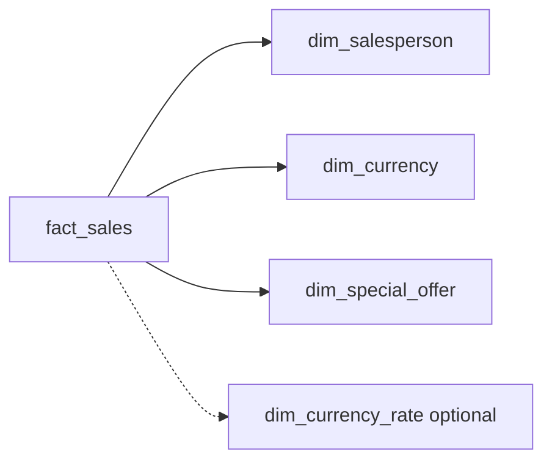

# Plus features plan — salesperson, currency, special offer

## Context

Core challenge (a–f + DQ reconciliations) is done. These three features are **plus** work for stakeholders—especially **Silvana Teixeira** (commercial / campaigns / sellers)—without changing the graded scope.

Staging already exposes the join keys (not yet on `fact_sales`):

- `models/staging/sales/stg_sales_salesorderheader.sql`: `sales_person_fk`, `currency_rate_fk`
- `models/staging/sales/stg_sales_salesorderdetail.sql`: `special_offer_fk`

Each feature = **one branch**, same rule as before: dim (+ staging/int) → wire FK on `int_fact_sales` / `fact_sales` → contract/YAML → optional analysis. Do **not** combine all three in one PR.

---

## Feature A — `dim_salesperson` (seller ranking)

**Branch:** `feature/dim_salesperson` — **DONE**

**Why:** Rank sellers by revenue/orders/qty — clear commercial demo.

**Sources:** `sales_salesperson` → name via `person_person` (same `BusinessEntityID`); optional `humanresources_employee` for job title.

**Build:**

1. Staging: `stg_sales_salesperson` (+ reuse `stg_person_person`)
2. `int_salesperson` / `dim_salesperson`: pk, name, territory_fk, bonus/quota if useful
3. Pass `sales_person_fk` through `int_fact_sales` → `fact_sales` + contract column
4. Recon tests + ranking analyses: later dedicated branches (not on this dim branch)

**Nulls:** many online orders have null `SalesPersonID` — left join only.

---

## Feature B — `dim_currency` (+ optional rate)

**Branch:** `feature/dim_currency`

**Why:** Show volume by currency; often one dominant currency — still valuable to prove.

**Sources:** `sales_currency`; optionally `sales_currencyrate` for rate attributes.

**Build:**

1. `stg_sales_currency` → `dim_currency` (code + name)
2. Optional: `stg_sales_currencyrate` → `dim_currency_rate` (rate id, from/to, dates, rates) **or** denormalize from/to codes onto the fact from the rate row
3. Wire `currency_rate_fk` on fact; derive `currency_code` (to-currency) for slicing when rate is present
4. **Rule to document:** `currency_rate_fk` null → treat as local/USD (or `Unknown`) for reporting
5. Analysis: later on dedicated analyses branch

**Keep scope small for v1:** `dim_currency` + fact FK/attributes; add `dim_currency_rate` only if you need rate history in BI.

---

## Feature C — `dim_special_offer` (campaigns for Silvana)

**Branch:** `feature/dim_special_offer`

**Why:** Sales **reason** ≠ campaign. Offers are the real promo lever on each **line** (`SpecialOfferID`). This answers “which campaigns drove volume?”

**Sources:** `sales_specialoffer` (optional `sales_specialofferproduct` later for product eligibility).

**Build:**

1. `stg_sales_specialoffer` → `dim_special_offer`: id, description, type, category, discount %, start/end, min qty, etc.
2. Wire `special_offer_fk` through int → fact + contract
3. Document offer **1 / No Discount** as baseline vs real campaigns
4. Analyses (campaign volume, etc.): later on dedicated analyses branch
5. Recon: later on `feature/data_quality_reconciliations` only

**Stakeholder story:** reason bridge = motivation; special offer = commercial campaign applied.

---

## Suggested priority (you choose first)

| Order | Feature | Stakeholder value | Effort |
|-------|---------|-------------------|--------|
| 1st (recommended) | **Special offer** | Directly answers Silvana’s promo/campaign concern | Medium |
| 2nd | **Salesperson** | Ranking / commercial team performance | Medium |
| 3rd | **Currency** | Quick “one currency?” insight | Small–medium |

Any order is fine; no hard dependency between A/B/C except all touch `fact_sales` (merge one before starting the next to avoid contract conflicts).

---

## Shared rules for every branch

- One feature per branch; merge before the next
- Marts stay `table`; contracts updated when fact columns are added
- `||` not `concat`; same folder style (`models/.../salesperson|currency|special_offer/`)
- Plus features: mention in README as optional commercial extensions
- Do not rewrite a–f logic; only additive FKs/dims on feature branches
- **Do not add reconciliation/singular count tests on dim branches** — batch those on `feature/data_quality_reconciliations`
- **Do not add analyses on dim branches** — batch question/ranking SQL on a dedicated analyses branch later

---

## Out of scope for this plus pack

- CRM / Salesforce / GA (narrative systems only)
- Full `dim_address`, `dim_territory` (unless separate branches later)
- Changing the 2011 audit expected value
